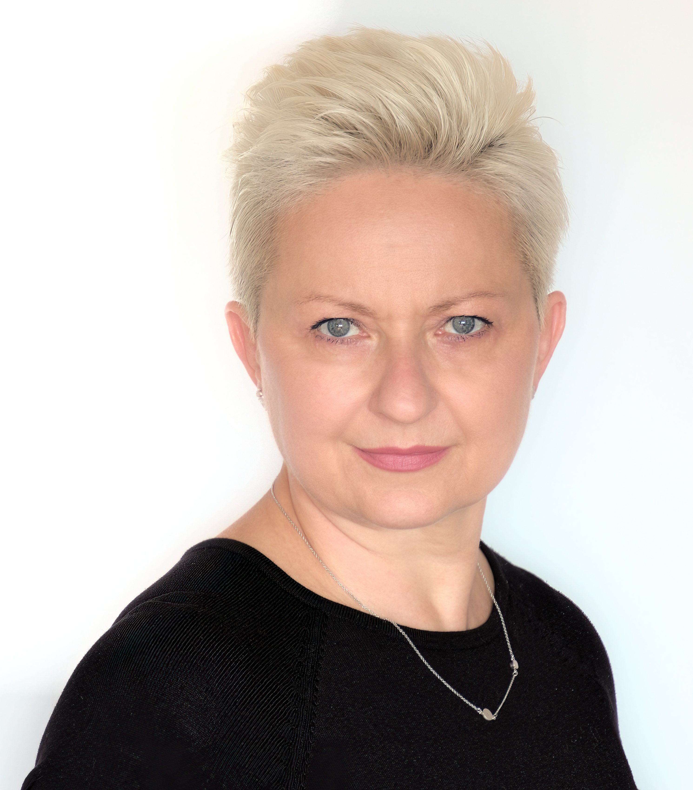

# Iwona Langer bio

## About

I am a graduate of the **English Philology Department** at the **[University of Silesia](https://us.edu.pl)** with long experience in teaching English to all age groups. Although, as an English teacher, I have had multiple opportunities of personal and professional development, I am now looking for a position that will offer new challenges and a possibility to learn new skills.  
  
I have successfully used the **[Scrum](https://www.scrum.org)** framework in my teaching experience and I find it very interesting. Therefore, I would appreciate the opportunity of further development and working in this area as well.

## Experience

  
English Language Teacher (click for details)

  I Zespół Ogólnokształcących Szkół Społecznych im. S. Konarskiego STO
  
  | Form of employment | from | to | period |
  |---|---|---|---|
  | Full-time | Oct 2005 | Present | 16 yrs 9 mos |
  
  Katowice, Woj. Śląskie, Polska
  

  

  
Lecturer in English (click for details)

  Teacher Training College of English, Sosnowiec
  
  | Form of employment | from | to | period |
  |---|---|---|---|
  | Full-time | Oct 1995 | Sep 2007 | 12 yrs |
  
  Sosnowiec, Woj. Śląskie, Polska
  
  
  

  
Lecturer in English (click for details)

  Higher School of Marketing Management and Foreign Languages, Katowice 
  
  | Form of employment | from | to | period |
  |---|---|---|---|
  | Contract | Oct 1998 | Jun 2006 | 7 yrs 9 mos |
  
  Katowice, Woj. Śląskie, Polska
  
  
  

  
Lecturer in English (click for details)

  Wyższa Szkoła Bankowa
  
  | Form of employment | from | to | period |
  |---|---|---|---|
  | Freelance | Oct 1995 | Jun 1997 | 1 yr 9 mos |
  
  Chorzów, Woj. Śląskie, Polska
  
  
  

  
English Language Teacher (click for details)

  IV Liceum Ogólnokształcące im. Stanisława Staszica
  
  | Form of employment | from | to | period |
  |---|---|---|---|
  | Part-time | Sep 1993 | Aug 1996| 3 yrs |
  
  Sosnowiec, Woj. Śląskie, Polska
  
 
  
## Education
  
* [University of Silesia in Katowice](https://us.edu.pl) 
  MA, English philology
* Nauczycielskie Kolegium Języków Obcych 
  BA, English philology
* [National University of Ireland, Galway](https://www.nuigalway.ie) 
  English philology
